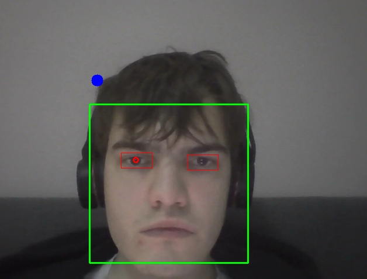

# Eyer

**Eyer** is a real-time eye-tracking and gaze estimation project built using OpenCV. It uses Haar Cascade Classifiers for detecting faces and eyes, SimpleBlobDetector for identifying pupils, and a simple calculation to estimate where the user is looking on the screen.

## Features

- **Face Detection**: The program uses a green rectangle to highlight the detected face in the camera feed.
- **Eye Detection**: A red rectangle is drawn around each detected eye within the face region.
- **Pupil Detection**: Pupil positions are identified as red circles within the detected eyes using blob detection.
- **Gaze Estimation**: A blue dot represents the estimated screen position where the user is looking. (Currently, this feature has limited accuracy and may require calibration or further refinement.)

## How it works

1. Face Detection:
    - The Haar Cascade Classifier haarcascade_frontalface_default.xml is used to detect faces in the video feed.
    - A green rectangle is drawn around the detected face.

2. Eye Detection:
    - Within the face region, the Haar Cascade Classifier haarcascade_eye.xml detects eyes.
    - Red rectangles are drawn around the detected eyes.
    - The top and bottom portions of the eye region are cropped to improve pupil detection accuracy.

3. Pupil Detection:

    - The eye region is preprocessed using histogram equalization, thresholding, erosion, dilation, and median blur to enhance pupil visibility.
    - The SimpleBlobDetector is used to detect the pupil, which is highlighted as a red circle.

4. Gaze Estimation:

    - Using the pupil's position within the eye, the program calculates an approximate gaze point on the screen.
    - A blue dot represents this gaze point, but its accuracy is limited and may vary based on user and environmental factors.

## Requirements

To run this project, you need the following:
- Python 3.x
- OpenCV library
- Haar Cascade XML files:
    - ```haarcascade_eye.xml```
    - ```haarcascade_frontalface_default.xml```

## Demo

Below is a screenshot of the program in action:



- Green rectangle is face recognizion
- Red rectangle is eye detection
- Red circle is pupil detection
- Blue dot is where the user is looking at (doesn't work that well)

## How to run

1. Clone this repository and navigate to the project directory.
2. Ensure you have the required dependencies installed.
3. Place the Haar Cascade XML files (haarcascade_eye.xml and haarcascade_frontalface_default.xml) in the same directory as the script.
4. Run the program using:
```python eyer.py```
5. Press q to exit the program.